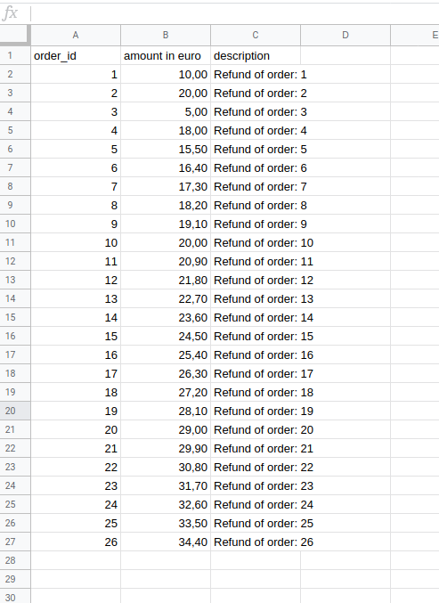
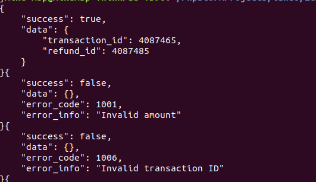

<p align="center">
  
</p>

# MultiSafepay refund script

Easily refund your MultiSafepay orders using this tool that can be used from the command line

## Installation
Place the two files in a place where PHP can be run

## Usage
### CSV file
Import the file in a program like Excel and fill in all the data you want to refund. 
The required data that is needed are.
* Order id
* Amount
* Description



### CLI
```shell
php refund.php <api_key>
```

## Output
On the CLI. the script will output all results of all request done to MultiSafepay,
after the program has finished there will be a json file created with all results of all successful and failed orders trying to refund



## Support
You can create issues on our repository. If you need any additional help or support, please contact <a href="mailto:integration@multisafepay.com">integration@multisafepay.com</a>
